# Office365 Basic Hygiene Checkup

This brief course covers some "basic hygiene" steps you can take to optimally secure your Office365 tenancy, in leui of Microsoft's "Advanced Threat Protection" service (*which can be costly as the volume of mailboxes scales out*).

Let's set the scene - you've inherited the family business, **Widgets LLC**. You've bought the domain "widgets.com", purchased an Office365 subscription, and you've sent your first email from @widgets.com. Hurrah! 

You've read stories about phishing, spear-phishing, "sextortion", etc., and you suspect that without a rigorous "phishing checkup", your fresh new domain is ripe for abuse (*and you're right!*). 

This checkup will guide you through the process of optimally configuring your Office365-hosted domain for email hygine and phishing protection.

## Preparation

### What do you need to know? 

1. First, you can expect this process to take around a week, depending on the complexity of your email setup.
2. Although email is a "standard", there are countless variations on how providers implement some features, especially the "newer" features like SPIF, DKIM, etc. There will be edge cases where systems won't work "as they should", and some companies you correspond with won't have implemented the same anti-phishing protections that you will. The best you can do is to optimize **your** domain's security profile.

### What do you need?

1. You'll need to create DNS records as part of the checkup, so you'll need administrative access to your DNS provider.
2. You'll also want to receive reports of email failures, so ensure that postmaster@widgets.com is forwarded to a mailbox you can read.

### Basic Navigation (How to find the `Exchange admin center`)

Throughout this tutorial, we'll be using the Office365 "Exchange admin Center". To navigate to the admin center, log into https://admin.microsoft.com/ using your Microsoft Office365 credentials. Your first landing page is `Microsoft 365 admin center`. 

In the navigation panel on the left-hand side, click on `... Show all` to expand navigation:

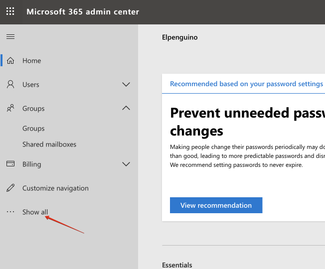

Under `Admin Centers`, click `Exchange`:

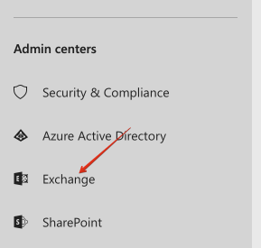

You are redirected to the `Exchange admin center`:

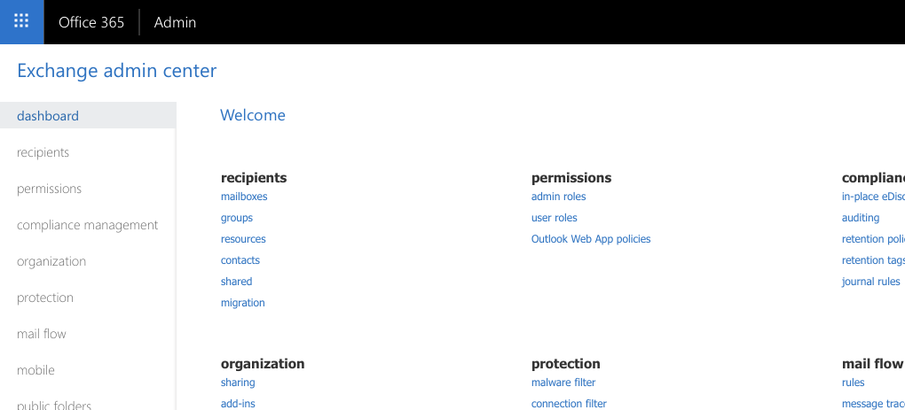


## 1. Setup a catch-all mailbox

### Summary ###

By default, when someone emails a non-existent address at your domain, they receive an mail delivery failure error (*a "bounce"*) in response. But if you want total control of incoming email for your domain, and you _don't_ want to bounce mis-addressed email (*to **accounst@widgets.com**, for example*), you'll want to setup an administrative "catch-all" mailbox.

You can either have catch-all emails delivered to your own mailbox, or you can establish a dedicated (*and licenced*) mailbox for this purpose.

* Difficulty: Medium
* Risk: Low

### Process

#### Create dynamic distribution list of all users 

In the `Exchange admin center`, navigate to `recipients` -> `groups`:

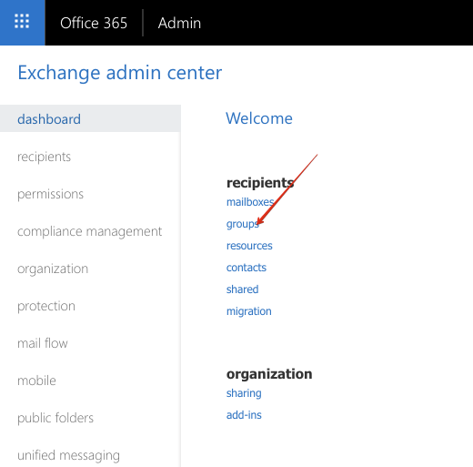

Under `groups`, click the arrow on the right of `+ New Ofifce 365 group` to drop down a list of group types, and select `Dynamic distribution list`:


Name your distribution list `all-users` (`Display name` **and** `Alias`), enter a note, and click `Save`:

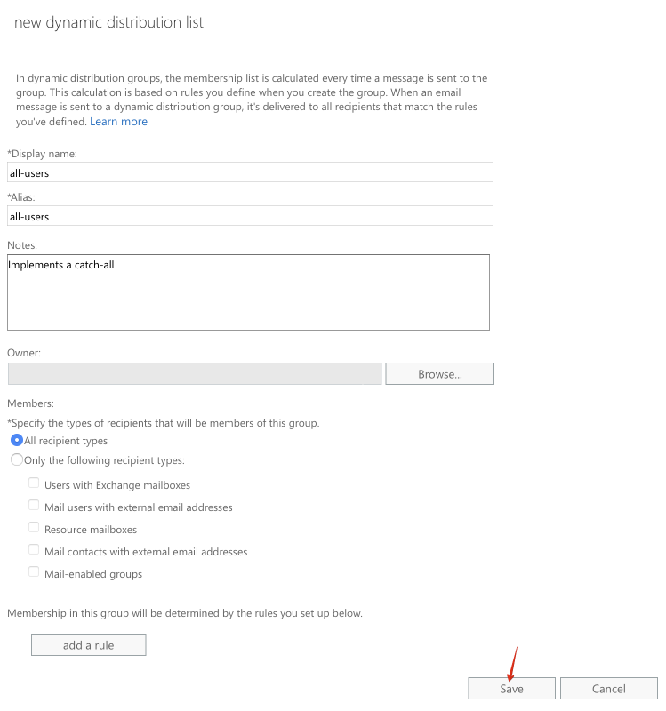

#### Alter mail flow

In `Exchange admin center`, navigate to `mail flow` -> `accepted domains`:


Highlight your domain, and click the pencil icon to edit it:

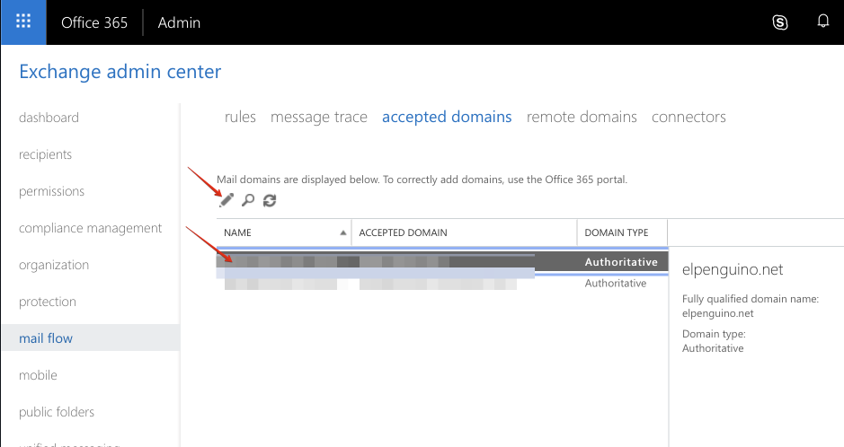

Under `This accepted domain is:`, choose `Internal Relay`, and click Save:

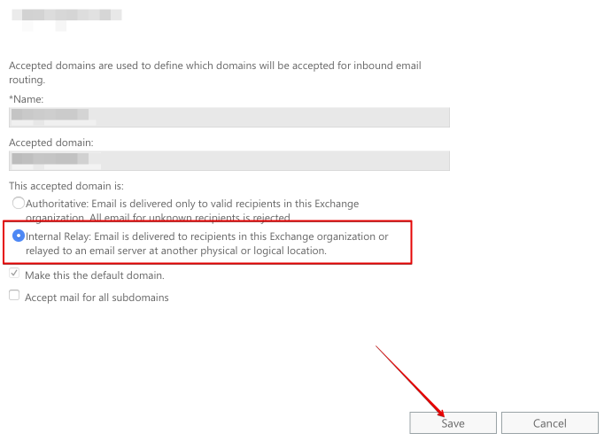

Upon saving, you'll be warned that you don't have an outbound connector for this domain. You can safely ignore this warning - you don't **need** an outbound connector, because you're about to implement a trick to deliver all un-matched email to a local mailbox.

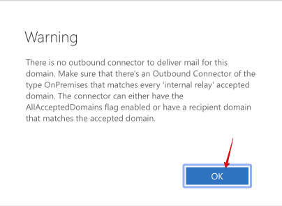

Navigate to `mail flow` -> `rules`:

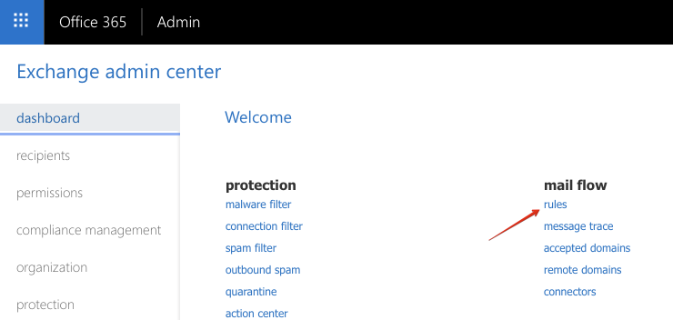

Click the `+` sign to add a new rule, and choose `Create new rule` from the dropdown:


Use the interface to create a rule with the following:

* Apply this rule if the sender is located.. **Outside the organization**
* Do the following.. 
  * **Redirect the message to \<your catch-all mailbox>**
  * **Prepend the subject of the message with: "[catch-all] "** (indicate to the recipient that this email has been "caught")
* Except if.. **The recipient is a member of all-users** (the dynamic group you created)

Save the rule:

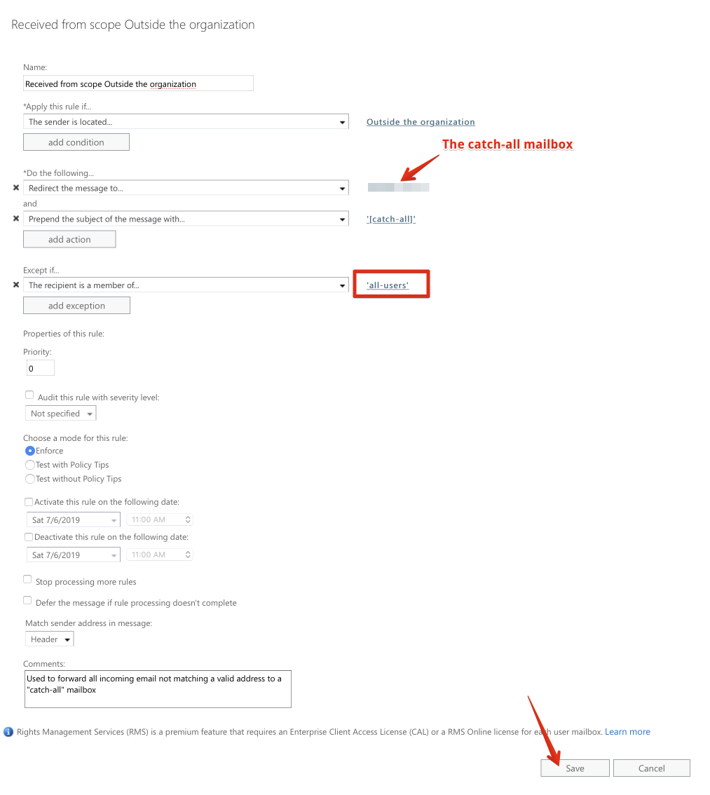

Finally, send an email from an outside address to thisaddressdoesntexist@widgets.com, and confirm that the message is delivered to the catch-all mailbox.


## SPF

### What is it?

Sender Protection Framework (SPF) is a way to tell the rest of the world which servers are authorized to send email form your domain. (*For example, if your domain is hosted with Office365, recipients should discard any emails delivered from spammersrus.com purporting to be sent from your domain!*)

### Do I have it?

Enter your domain name into an online SPF testing tool (https://mxtoolbox.com/spf.aspx, for example). For maximum hygine, confirm that:

1. An SPF record exists for your domain
2. The SPF record ends in `-all` (A "hard fail", which instructs receiving mailservers that you do **not** authorize any senders other than those specified, for your domain)

Here's an example of a well-defined SPF record, which hard-fails any unauthorized sources:


Here's an SPF record which, while defined, only soft-fails unauthorized sources (*leaving it up to the receiving mailserver to "make a judgement call"*):

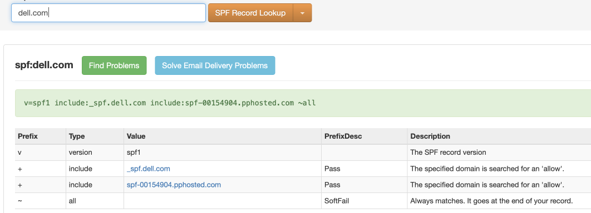

And **here's** an example of a domain with no SPF record:


### How do I get it?

You'll need access to administer your domain's DNS, and you'll want to create a DNS TXT record with the necessary SPF data. [Microsoft's support docs](https://docs.microsoft.com/en-us/office365/securitycompliance/set-up-spf-in-office-365-to-help-prevent-spoofing) explain the process in detail. There are many online SPF record generators, one notable one is https://mxtoolbox.com/SPFRecordGenerator.aspx. If you're fully hosted on Office365, for example, your SPF record could be as simple as `v=spf1 include:spf.protection.outlook.com -all`.

## DKIM

### What is it?

DomainKeys Identified Mail (DKIM) is another strategy used to prove to the world which servers **should** be allowed to send email for your domain.

### Do I have it?

Confirm that DKIM DNS **records exist** for your domain, by using a DKIM validation tool (https://mxtoolbox.com/dkim.aspx, for example). Supply your domain name and "selector1" as a selector. 


Here's an example of a correctly configured domain (Hosted on Office365):

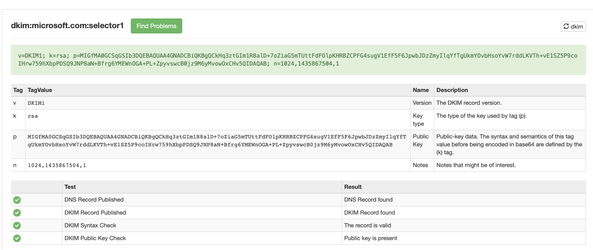

Repeat the test for every domain from which you send email (*if you have more than one domain name*).

Confirm that DKIM **signing** is setup for your domain by following [these Microsoft instructions](https://docs.microsoft.com/en-us/office365/securitycompliance/use-dkim-to-validate-outbound-email):

1. Sign in to Office 365 with your work or school account.
2. Select the app launcher icon in the upper-left and choose Admin.
3. In the lower-left navigation, expand Admin and choose Exchange.
4. Go to Protection > dkim.
4. Select the domain for which you want to enable DKIM and then, for Sign messages for this domain with DKIM signatures, choose Enable. Repeat this step for each custom domain.

### How do I get it?

[Microsoft's guide](https://docs.microsoft.com/en-us/office365/securitycompliance/use-dkim-to-validate-outbound-email) is detailed (*but confusing*). 

First, determine your **initial domain**. This domain was created for you when you setup Office365, and it ends in *.onmicrosoft.com*. Typically, your initial domain will be the your actual domain name (*i.e "widgets.com"*), with dots removed, followed by "*onmicrosoft.com*". So *widgets.com*'s **initial domain name** will be *widgetscom.onmicrosoft.com*.

**Tip: You can also follow the steps above for enabling DKIM in Office365's Exchange Online admin. The resulting page will show you all your configured domains.**

Secondly, determine your **domainGUID**. Unless you're a "GCC High" goverment customer, your **domainGUID** will simply be the same as your desired email domain - i.e, "*widgets.com*", with dots replaced with dashes. (*i.e., "widgets-com"*).

Now, that you have yoru **initial domain** and **domainGUID**, for every domain you want to protect, create 2 CNAME DNS records:

```
Host name:			selector1._domainkey
Points to address or value:	selector1-<domainGUID>._domainkey.<initialDomain> 
TTL:				3600

Host name:			selector2._domainkey
Points to address or value:	selector2-<domainGUID>._domainkey.<initialDomain> 
TTL:				3600
```

In the example of widgets.com, the following 2 records will be created:

```
Host name:			selector1._domainkey
Points to address or value:	selector1-widgets.com._domainkey.widgets-com.onmicrosoft.com
TTL:				3600

Host name:			selector2._domainkey
Points to address or value:	selector2-widgets.com._domainkey.widgets-com.onmicrosoft.com 
TTL:				3600
```

Now enable DKIM **signing** for your domain by following [these Microsoft instructions](https://docs.microsoft.com/en-us/office365/securitycompliance/use-dkim-to-validate-outbound-email):

1. Sign in to Office 365 with your work or school account.
2. Select the app launcher icon in the upper-left and choose Admin.
3. In the lower-left navigation, expand Admin and choose Exchange.
4. Go to Protection > dkim.
5. Select the domain for which you want to enable DKIM and then, for Sign messages for this domain with DKIM signatures, choose Enable. Repeat this step for each custom domain.

(*Note : If the option to enable DKIM signing for your custom domain doesn't exist, you may need to [use PowerShell](https://www.funkypenguin.co.nz/note/enabling-dkim-on-office365-easy-as-bathing-a-cat/)*)

## DMARC

### What is it?

Domain-based Message Authentication, Reporting, and Conformance (DMARC) augments SPF, by testing not only the "envelope sender" of an email (*the address that bounces would go to*), but also the purported "From" address of the sender.

Unlike SPF, DMARC offers far more flexibility regarding what remote mail systems **do** with email which fails validation - you can choose to reject/quarantine a percentage of emails, have delivery reports sent to a nominated email address daily, etc.

**Be aware that *lots of receiving server* will send you a report.**

**Depending on the volume of mail you're sending (and how attractive your domain is to spoofers), this can result in hundreds of DMARC reports a day from different servers. This can become a little overwhelming to manage. This is why there are so many DMARC reporting toolsN.**

My advice sign up with a tool that can help you process and interpret your DMARC reports, let them handle the heavy processing of parsing hundreds of reports a day and making actionable graphs based on the information they parse. 


### Do I have it?

Confirm that DMARC DNS TXT **records exist** for your domain, by using a DMARC validation tool (https://mxtoolbox.com/dmarc.aspx, for example). Supply your domain name and click `DMARC Lookup`.

Here's an example of a correctly configured domain:

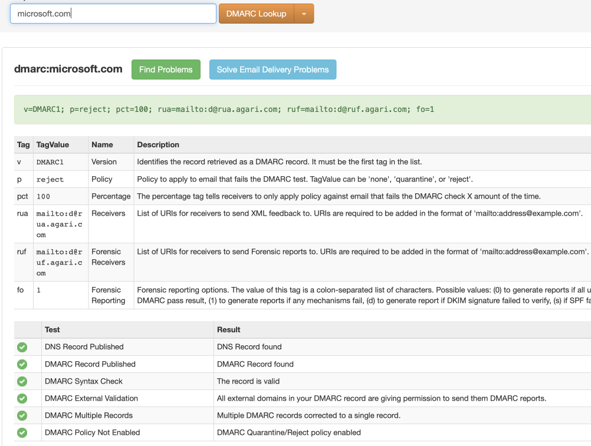

And here's an example of an unconfigured domain:


### How do I get it?

To protect your outgoing email with DMARC, setup a DNS TXT record.

Microsoft provides a [guide](https://docs.microsoft.com/en-us/office365/securitycompliance/use-dmarc-to-validate-email), as does [Google](https://support.google.com/a/answer/2466563?hl=en). You can also use an [online DMARC record generator](https://mxtoolbox.com/DMARCRecordGenerator.aspx?).

At the most basic (*and harmless*) level, add a TXT record like this to your domain:

`_dmarc.yourdommain.com --> v=DMARC1; p=none; rua=mailto:postmaster@widgets.com`

If you want to be more aggressive, and instruct remote servers to **reject** any emails which appear to be spoofed from you, use a record like this:

`_dmarc.yourdommain.com --> v=DMARC1; p=reject; rua=mailto:postmaster@widgets.com`

You can also stagger the rollout of DMARC, by instructing remote servers to reject only 10% of your email, and gradually increase this percentage:

`_dmarc.yourdommain.com --> v=DMARC1; p=reject; rua=mailto:postmaster@widgets.com; pct=10`


## IPv6

To support IPv6 in Office 365 you will need to open a support request with Microsoft per
https://docs.microsoft.com/en-us/office365/SecurityCompliance/support-for-anonymous-inbound-email-messages-over-ipv6

